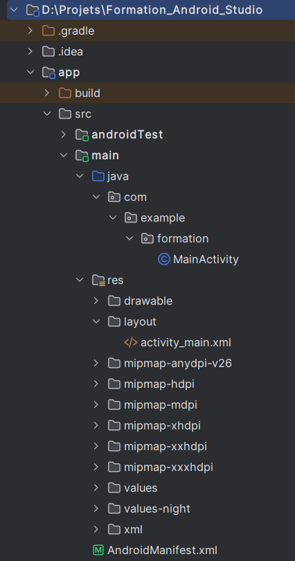
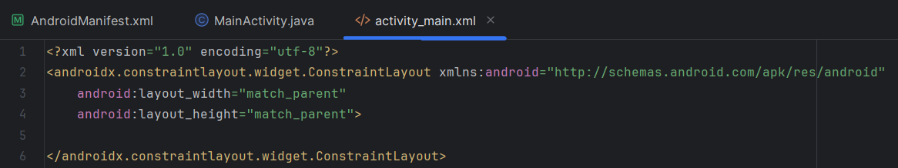
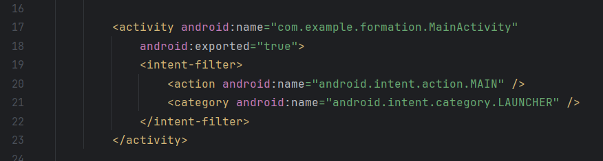
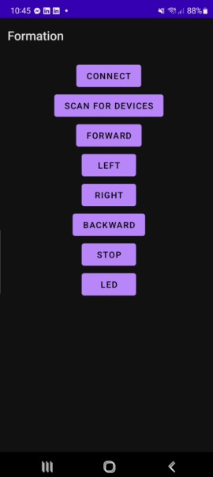
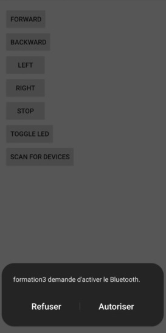

# Contrôle d'une Voiture Télécommandée via Bluetooth

## Introduction

Nous souhaitons programmer une application sur **Android Studio** afin de contrôler une voiture télécommandée via **Bluetooth** depuis un smartphone.

---

## Difficultés

- **Android Studio** utilise trois langages de programmation : **Kotlin, Java et XML**.
- Les fichiers présents sur GitHub contiennent un programme en **Kotlin** permettant d’établir une connexion Bluetooth.
- Cependant, ce programme comporte des **erreurs** que je n’arrive pas à corriger (ne connaissant pas Kotlin).
- Par conséquent, j’ai décidé de configurer **Android Studio** pour ne programmer qu’en **Java**.

---

## Mise en place du code Java

Sur un **nouveau projet vierge** :

### 1️⃣ Remplacement du fichier MainActivity
📂 **Chemin du fichier :**  
`D:\Projets\Formation_Android_Studio\app\src\main\java\com\example\formation`

✅ **Modification :**  
- Remplacement du fichier **MainActivity.kt** par une classe **Java**.

### 2️⃣ Modification du fichier activity_main.xml
📂 **Chemin du fichier :**  
`D:\Projets\Formation_Android_Studio\app\src\main\res\layout\activity_main.xml`

🖼️ **Objectif :**  
- Ajuster automatiquement l’interface utilisateur aux dimensions de l’appareil.
- Le fichier `activity_main.xml` gère la **mise en page de l’application**.

### 3️⃣ Configuration du fichier AndroidManifest.xml
📂 **Chemin du fichier :**  
`D:\Projets\Formation_Android_Studio\app\src\main\AndroidManifest.xml`

✅ **Modifications :**  
- Déclaration de **MainActivity** comme **activité principale** de l’application.

 

---

## Travail à faire ✅

🔹 **Se familiariser** avec **Android Studio**  
🔹 **Implémenter** le programme de **connexion Bluetooth en Java**  

---

# Séance du 06/03/2025

On en est à la version 1 du programme. Or il comporte des lacunes :

- Le programme nécessite dans le code l'adresse MAC du module Bluetooth. Dans l'idéal, on aimerait pouvoir se connecter depuis l'application à partir d'une liste d'appareils.
- Le module nécessite un PIN : le programme n'est pas adapté pour cela.
- On ne l'a pas testé car il y avait des problèmes de connexion avec le module.

On va donc en attendant essayer d'implémenter ces fonctionnalités.

---

# Séance du 13/03/2025

En modifiant le programme, j'arrive à avoir une interface sur mon portable :

Or, à chaque fois que j'essaye de scanner les appareils environnants, l'application se ferme.  
La cause est très probablement des permissions manquantes lorsqu'on essaye d'activer le Bluetooth à partir de l'appareil.  
L'erreur non prise en compte causerait le "crash".

---

# Séance du 20/03/2025

On arrive maintenant à activer le Bluetooth à partir de l'application :

Or, la liste d'appareils ne s'affiche toujours pas.  
Je suis incertain de la cause de l'erreur.